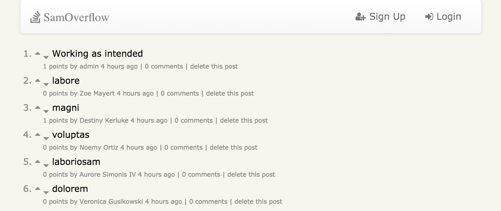

# SamOverflow
A 2-day group project building a clone of StackOverflow, lovingly called SamOverflow in honor of group member Samuel Heinz. We used Sinatra, ActiveRecord, and PostgreSQL as well as some AJAX to enable post creation, upvoting/downvoting, commenting, etc. 

## Team SamsoniteGokus
- [Samuel Heinz](https://github.com/samheinz)
- [Mikey Moore](https://github.com/mikeymoore)
- [Jason Sutter](https://github.com/jasonsutter87)
- [Jonathan Hall](https://github.com/jlhall)

## Key Deliverables
  - Polymorphic associations
  - AJAX for dynamic voting/sorting and scrolling
  - A user can post questions
  - A user can answer questions
  - A user can comment on both questions and answers
  - A user can see a given answer is best (popular voting rather than by OP choice)
  - A user can upvote or downvote comments but only once
  - A user can't add questions/answers or vote until logged in
  - A user can see posts/comments/votes without logging in
